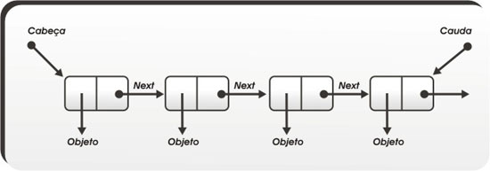

# Estruturas de dados

Esse resumo foi feito para estudo, usando o que aprendi na disciplina de Estrutura de Dados no curso de Ciência da Computação e consultando [esse site](https://www.ime.usp.br/~pf/algoritmos/).

- [Vetores](#vetores)
- [Listas encadeadas](#listas-encadeadas)
- [Listas duplamente encadeadas](#listas-duplamente-encadeadas)

## Vetores

É uma lista sequencial, os elementos são acessados através do índice.

### Busca

Essa busca retorna o índice do elemento ou -1 se ele não tiver no vetor

```
busca(int x, int tamanho, int vetor[]){
  int k = tamanho-1;
  enquanto(k>=0 && v[k]!=x){
    k--;
  }
  retorne k;
}
```

### Inserção

Temos duas opções:

1. Inserir dados sempre no final
2. Inserir dados entre uma posição **k** e **k-1**

Nas duas opções o retorno será o novo tamanho do vetor.

Inserindo no final temos

```
inserir(int x, int tamanho, int vetor[]){
  int vetor[tamanho] = x;
  retorne tamanho + 1;
}
```

Inserindo entre **k** e **k-1**, precisamos abrir espaço nesses índices, então percorrermos o vetor do começo ao final, movendo os elementos para uma posição acima, e quando chegamos no índice **k+1** atribuímos a ele o valor de **k** e encerramos o loop, e então adicionamos o valor desejado a posição **k** do vetor:

```
inserir(int x, int k, int tamanho, int vetor[]){
  para(int j = tamanho; j>k;j--){
    vetor[j] = vetor[j-1];
  }
  vetor[k] = x;
  retorne tamanho + 1;
}
```

### Remoção

Para remover o elemento do índice **k** basta movermos os elementos do pedaço [k+1, n-1] para [k, n-2]. No nosso caso retornaremos elemento removido.

```
remover(int k, int tamanho, int vetor[]){
  int x = vetor[k];
  para(int i =k+1;i<tamanho;i++){
    vetor[i-1]=vetor[i]
  }
  retorne x;
}
```

# Listas encadeadas

É uma lista onde cada elemento possui um ponteiro para o próximo elemento. Os elementos podem ou não estar em posições sequenciais na memória.

<p align="center">
  
</p>

## Busca

```
buscar(int x, int *inicio){
  enquanto(*)
}
```
